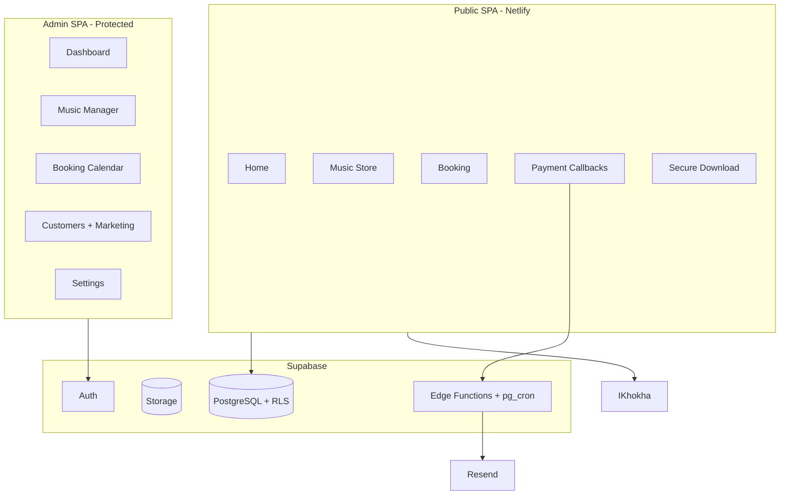

# DJ Ntsira Platform — Build & Implementation Plan

**Date:** 2026-06-05  
**Status:** Phase 0 complete; Phase 1 ready for 6 parallel agents

## Current state

The repo was planning-only. **Phase 0** scaffolded the full application foundation:

- Vite + React + Tailwind v3 + all dependencies
- Supabase migrations 001 (baseline) + 002 (PRD extensions)
- Shared libs, Zod schemas, route stubs, i18n skeleton
- `agent-contracts.md` for parallel agent handoff

**Stack (locked):** React 18 + Vite, Tailwind v3, React Router v6, Supabase, TanStack Query v5, RHF + Zod, iKhokha, Resend, i18next, Howler.js, Netlify.

## Document precedence

1. **PRD** — business logic, edge cases, validation (highest authority)
2. **Platform Spec** — module boundaries, routes, email intent
3. **initial.prompt.md** — implementation scaffold

### Key PRD deltas (encoded in 002 migration + shared libs)

| Area | PRD requirement |
|------|-----------------|
| Purchases | `status` pending/paid; never mark paid on redirect alone |
| Discounts | Floor R1.00; re-validate at payment |
| Booking hours | Whole hours 1–12 |
| Deposit | Round up to nearest rand |
| Booking status | State machine transitions enforced |
| Clash check | Blocks: pending, deposit_requested, deposit_paid, confirmed |
| Customers | `marketing_opted_out`; type auto-computed |
| Emails | `email_logs` table mandatory |
| Marketing | `sent_campaigns` + unsubscribe |
| Admin i18n | English only; public isiXhosa default |

## Architecture

## Execution model

### Phase 0 — Lead agent ✅

Deliverables: scaffold, migrations, shared libs, route skeleton, docs, agent-contracts.

### Phase 1 — Six parallel agents

| Agent | Owns |
|-------|------|
| 1 — UI Shell | `components/ui/*`, `layout/*`, `shared/*`, `i18n/*`, Auth, Login |
| 2 — Music Commerce | Public music pages, payments, download, `ikhokha.js` |
| 3 — Booking | Book flow, availability, clash/buffer |
| 4 — Admin Core | Dashboard, MusicManager, Settings |
| 5 — Admin CRM | Bookings, Calendar, Customers, Marketing |
| 6 — Backend | Edge functions, cron migrations 003/004 |

### Phase 2 — Integration

Build verification, contract resolution, i18n key script, README, acceptance checklist.

## Route map

| Route | Agent |
|-------|-------|
| `/` | 1 + 2 |
| `/music`, `/music/:id` | 2 |
| `/book`, `/booking-confirmed` | 3 |
| `/payment/success`, `/payment/cancel`, `/download/:token` | 2 |
| `/admin/login` | 1 |
| `/admin`, `/admin/music`, `/admin/settings` | 4 |
| `/admin/bookings`, `/admin/calendar`, `/admin/customers`, `/admin/marketing` | 5 |

## Acceptance criteria

- All routes render without console errors in production build
- Purchase + booking flows per PRD
- Language switcher on public; admin English only
- Auth: login → protected admin → logout
- `netlify.toml` SPA redirects; `.env.example` complete

## Handoff

See [agent-contracts.md](./agent-contracts.md) for hook signatures, table columns, and file ownership.
